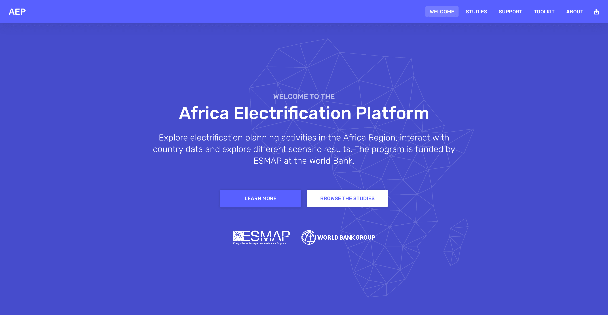

# Africa Electrification Platform

Explore electrification planning activities in the Africa Region, interact with country data and browse different scenario results. The program is funded by ESMAP at the World Bank.

## Documentation

* Want to run the project locally? Check the [development guidelines](/DEVELOPMENT.md);
* Interested in configuring a study or updating static content? Visit the [documentation](/docs);
* To upload a dataset to Energydata.info, so it can be used in this tool, please check [these steps](/docs/DATASETS.md).

## License

This project is licensed under **The MIT License (MIT)**, see the [LICENSE](LICENSE) file for more details.

