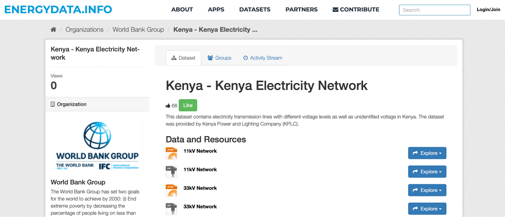
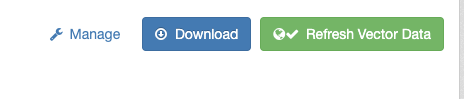
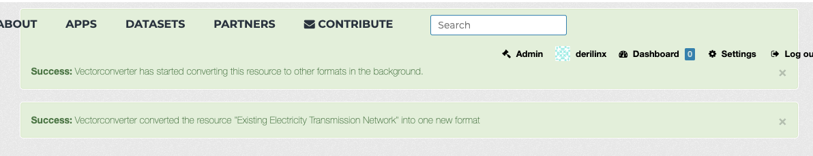
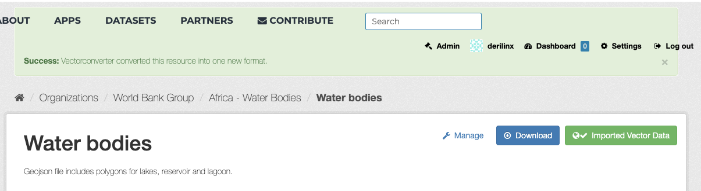
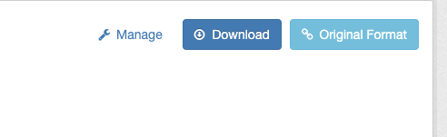
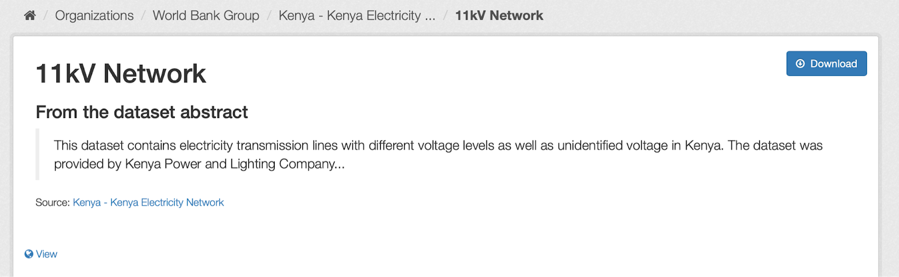

# Dataset Preparation at Energydata.info
## Adding layers
Before adding a layer on the selected study it is necessary to prepare the layer data in the proper web format. Follow the steps below.

1) Select the particular resource that you want to include on the study:

2) Check if the resource have the proper layer format, otherwise "Refresh Vector Data" to convert to the proper web format.

The current list of source vectortiles formats supported is: shp, zip, shpzip and broken geojson. The converter apply, based on the file size:

- GeoJSON non-wgs84 -> GeoJSON wgs84 (small size)
- GeoJSON non-wgs84 -> tiles images (big size)

3) Once converted you will receive a message informing that the process is done and you can check the new resource created in the web layer format:

You can always check back the original resource by clicking on "Original Format":

4) Now you can copy the URL from Download button, with the converted layer end point to be used to Add a New Layer in to the Config File

