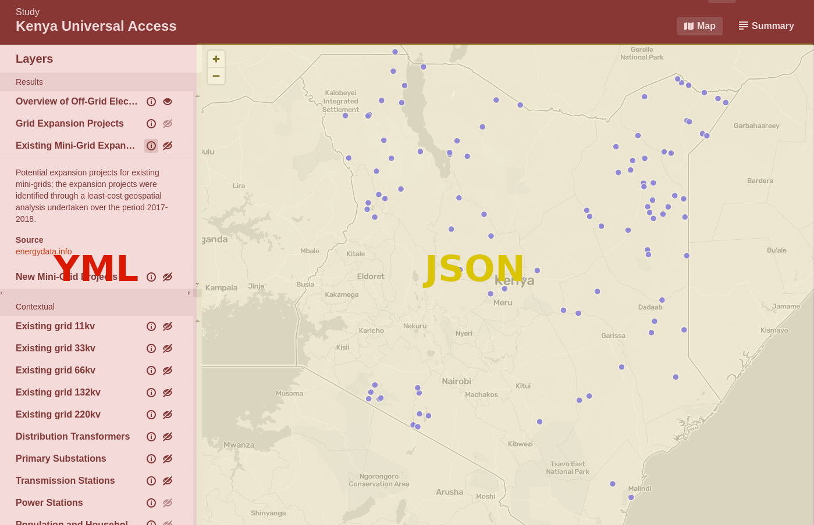

# Managing studies

* [Anatomy of a study](#anatomy-of-a-study)
  * [Study configuration](#study-configuration)
  * [Map configuration](#map-configuration)
  * [Validating configuration](#validating-configuration)
* [Howto](#hotwo)
  * [Add a new study](#add-a-new-study)
  * [Add a layer](#add-a-layer)
* [AEP Map Style](#aep-map-style)
  * [Default styles](#default-styles)
  * [Custom markers](#custom-markers)
* [FAQ](#faq)
* [Troubleshooting](#troubleshooting)

## Anatomy of a study
The study configuration consists of two files:

* a `yml` file that contains the basic information and metadata of the study.
* a `json` file that contains the map configuration.



### Study configuration
The main information and metadata of each study is managed through a `yml` file, with the following structure. For a full example, please see [`kenya.yml`](../study/posts/kenya.yml)

| key | format | description |
| --- | --- | --- |
| title | `string` | The title of the study |
| bbox | [`LngLatBounds`](https://docs.mapbox.com/mapbox-gl-js/api/geography/#lnglatbounds) object | The initial bounds of the map |
| zoomExtent | `array` of `numbers` | The minimum and maximum zoom of the map |
| mapConfig | `string` | The filename that contains the study's map configuration |
| country | `string` | Country name |
| study | `object` | Metadata about the study |
| study.consultant | `string` | Name of the consultant |
| study.period | `string` | Period of the study |
| study.scope | `string` | Brief decription of the scope of the study |
| study.summary | `string` | Summary of the study results |
| platform | `object` | Reference to an external platform that hosts full study results |
| platform.title | `string` | Title of the platform |
| platform.url | `string` | URL of the platform |
| layers | `array` | The layers that make up the layer switcher |
| layers[].id | `string` | Unique ID of the layer |
| layers[].name | `string` | Name of the layer that appears in the layer switcher |
| layers[].category | `enum` (`contextual`, `results`) | The layer category is used to organize the layers |
| layers[].mbLayer | `string` | ID of the layer. Should refer to a layer in the map configuration |
| layers[].info | `string` | Used for the description in the info drawer |
| layers[].disabled | `boolean` | If set to true, the `enable/disable` icon will be disabled. *Optional, defaults to false* |
| layers[].visible | `boolean` | If set to true, this layers is enabled on first load. *Optional, defaults to false* |
| layers[].info | `string` | Used for the description in the info drawer |
| layers[].source | `object` | Link to the data source |
| layers[].source.name | `string` | Name of the source link |
| layers[].source.url | `string` | URL of the data source |

### Map configuration
The map is configured using the Mapbox Style specification. This provides a high degree of control over the style and interaction of the map of each study. Please refer to the [Mapbox documentation](https://docs.mapbox.com/mapbox-gl-js/style-spec/) for a full description of the style spec.

In addition to the default Mapbox styling, AEP has its own set of default styles, optimized for country level analysis. For more details see the [AEP default style](#aep-default-style) section.

#### Validating configuration
The `yml` and `json` files in `/content/study` are automatically validated when pushing a change to Github. If validation fails, it won't be possible to merge these changes into the `main` branch.

Validation is done in two steps:

1. the `yml` files are validated using the study schema in [`/schema/validate.js`](/schema/validate.js)
2. the `json` files are validated using the [Mapbox Style Specification](https://docs.mapbox.com/mapbox-gl-js/style-spec/)

#### Validating locally
To validate changes prior to pushing them to Github, you can run the following command:

```
yarn validate
```

[To top](#managing-studies)

## Howto
### Add a new study

1. create a new Github branch from `main`
2. add a `yml` file to `/content/study/posts` with the [study configuration](#study-configuration)
3. add a `json` file to `/content/study/posts` with the [map configuration](#map-configuration)
4. set up a Pull Request and merge once [the validations](#validating-configuration) are run successfully

### Add a layer
Adding a layer and allowing users to interact with it, requires three things:

1. add a source to the Mapbox Style Specification  
``` json
"minigrid-proposed": {
  "data": "https://aep-tiles.staging.derilinx.com/geojson/ke/proposed_kosap_minigrid-wgs84.json",
  "type": "geojson"
}
```
2. add a layer to the Mapbox Style Specification that references the source  
```json
{
  "id": "minigrid-proposed",
  "type": "circle",
  "source": "minigrid-proposed"
}
```
3. add a layer to the study configuration (`yml`). This configures the layer in the layer switcher.  
```yml
  - id: minigrid-new
    name: New Mini-Grid Projects
    category: result
    mbLayer: minigrid-proposed
    info: Potential mini-grid projects; these projects were identified through a least-cost geospatial analysis undertaken over the period 2017-2018.
    source:
      name: energydata.info
      url: https://energydata.info/dataset/kenya-potential-new-mini-grid-sites
```

[To top](#managing-studies)

## Map style
### AEP default style


### Custom markers
AEP supports a number of custom icons that can be used to style point data instead of colored circles. See the folder `/content/icons` for the icons that are currently supported.

#### Add icon to a layer
Define a [`symbol`](https://docs.mapbox.com/mapbox-gl-js/style-spec/layers/#symbol) layer. The name of the `icon-image` is the basename of the file, without extension `.png`.

For example:

``` json
{
  "id": "transformers",
  "type": "symbol",
  "source": "transformers",
  "source-layer": "data_layer",
  "layout": {
    "icon-image": "electricity"
  }
}
```

#### Add new icons to AEP
New icons can be added to [`/content/icons`](/content/icons). They should be in `.png` format and measure 64 x 64px.

[To top](#managing-studies)

## FAQ

## Troubleshooting

### Map shows an unexpected layer
If the map loads with a layer that can't be managed through the layer switcher, it's likely that you added a layer in the Mapbox Style that isn't referenced in the layer configuration of the `yml`. This is by design. It allows you to overlay a contextual layer on the map that the user don't have control over. A use case could be a layer that adds a disputed border.
